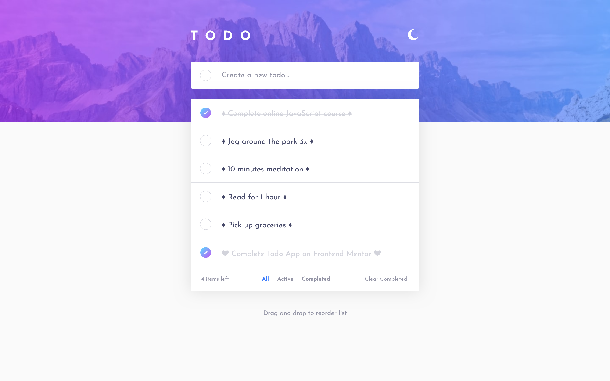
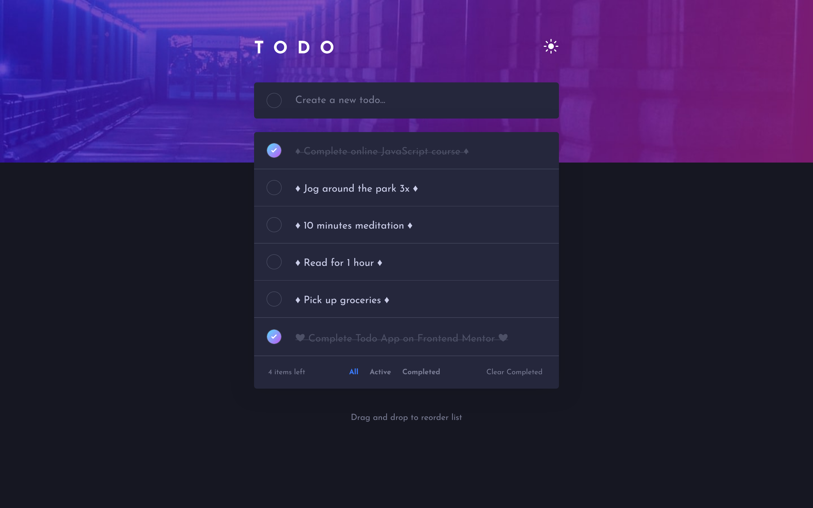
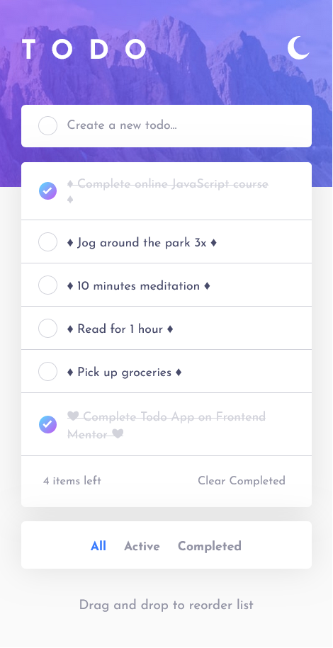
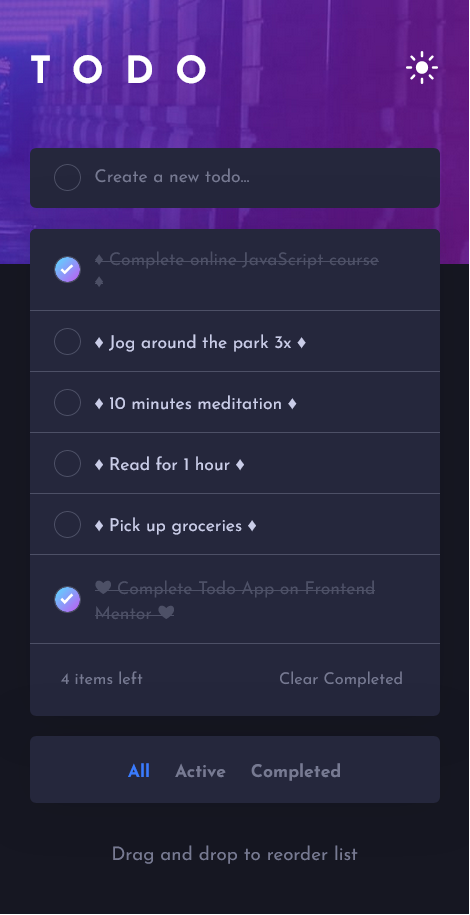

<!-- TODO: To complete the README.md -->

# Frontend Mentor - Todo app solution

This is a solution to the [Todo app challenge on Frontend Mentor](https://www.frontendmentor.io/challenges/todo-app-Su1_KokOW). Frontend Mentor challenges help you improve your coding skills by building realistic projects. 

## Table of contents

- [Overview](#overview)
  - [The challenge](#the-challenge)
  - [Screenshot](#screenshot)
  - [Demo](#demo)
- [My process](#my-process)
  - [Built with](#built-with)
  - [What I learned](#what-i-learned)
- [Author](#author)

## Overview

### The challenge

Users should be able to:

- View the optimal layout for the app depending on their device's screen size
- See hover states for all interactive elements on the page
- Add new todos to the list
- Mark todos as complete
- Delete todos from the list
- Filter by all/active/complete todos
- Clear all completed todos
- Toggle light and dark mode
- **Bonus**: Drag and drop to reorder items on the list

### Demo

### Screenshot

## My process

### Built with

- Semantic HTML5 markup
- CSS custom properties
- Flexbox
- Mobile-first workflow
- [React](https://reactjs.org/) - JS library
- [React Redux](https://react-redux.js.org/) - Official React bindings
- [Sass](https://sass-lang.com/) - CSS extension language
- [Vite](https://vitejs.dev/) - Development environment

### What I learned

- Utilized React Redux and Redux Toolkit for streamlined state management of the todo list.
- Implemented drag-and-drop functionality for reordering todo items using events like `onDragStart`, `onDragEnter`, `onDragEnd`, and `Array.splice()`.
- Dynamically switched theme colors with the help of the `useState()` hook in React.
- Achieved a responsive web design layout using CSS with `@media screen and (max-width: 768px) {}` queries.

## Author

- Website - [Ruo-Fang Wang](https://wang0857.github.io/myWebPortfolios/)
- Frontend Mentor - [Ruo-Fang Wang](https://www.frontendmentor.io/profile/wang0857)
- LinkedIn - [Ruo-Fang Wang](https://ca.linkedin.com/in/ruo-fang-wang-550269226)

